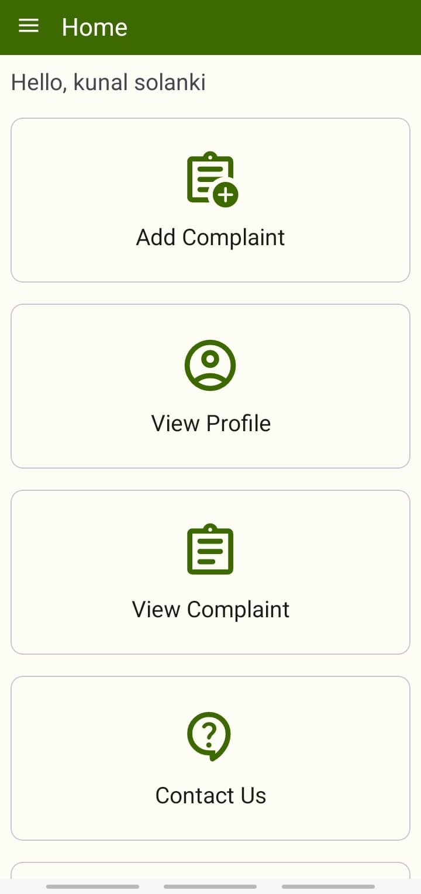
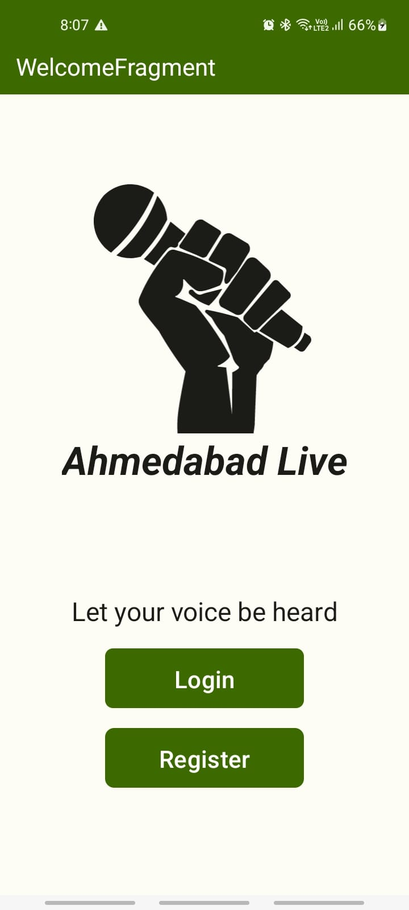
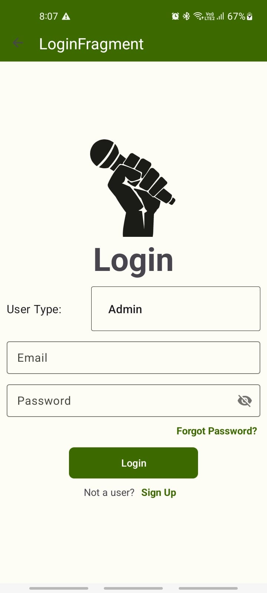
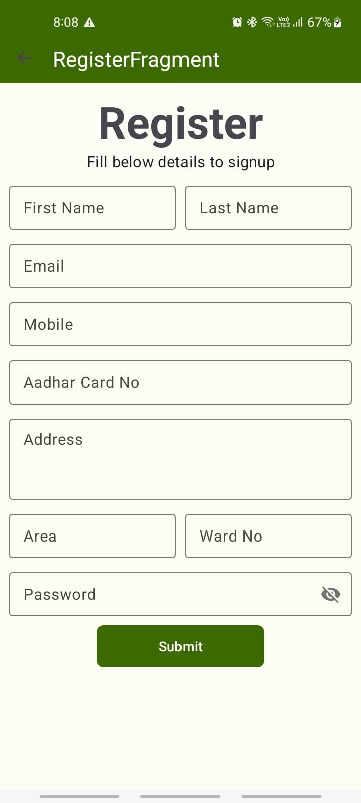
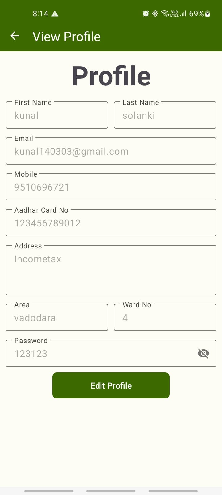
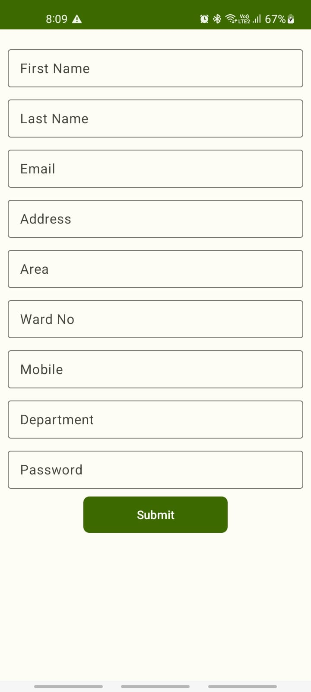
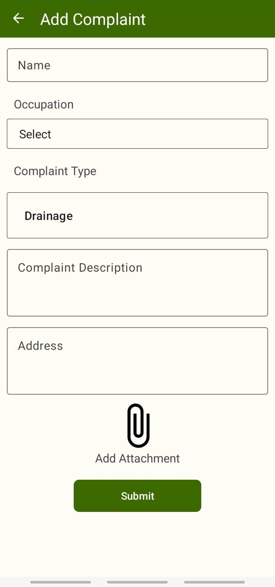
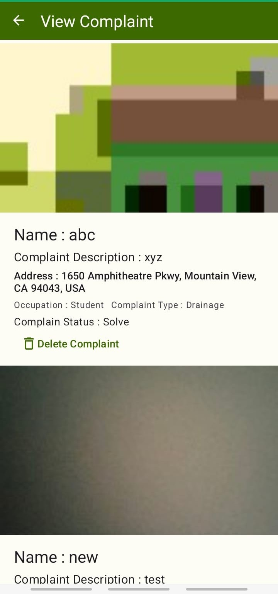
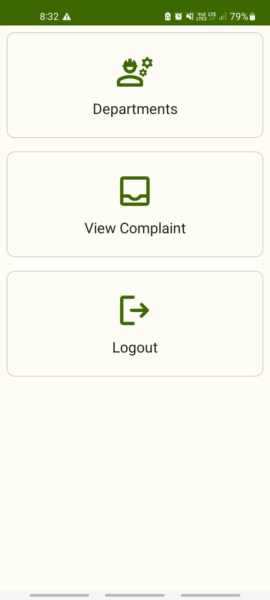
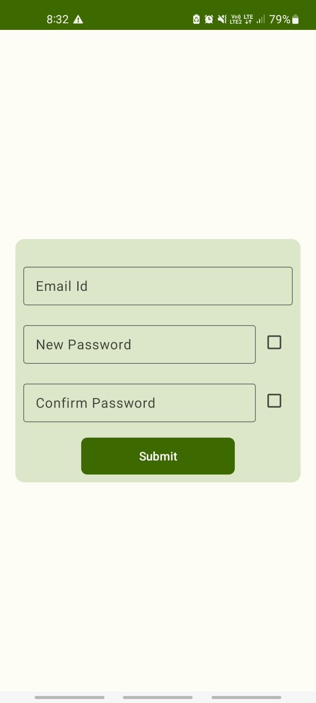

# Ahmedabad Live – Complaint Management System

An Android-based **Online Complaint Management System** designed to streamline the filing, tracking, and resolution of public complaints for various government departments. Citizens can submit complaints through an intuitive Android app, which routes them to the appropriate officials while enabling real-time tracking and communication.

---

## 📱 App Features

- 📌 Complaint submission with date, time, and location
- 📡 Real-time status tracking with automatic updates
- 🧾 Document/image attachments
- 🗂 Complaint assignment to relevant departments
- 📬 Notifications and feedback system
- 🔐 Secure user login & data encryption
- 📊 Admin dashboard with analytics and reports

---

## 🛠 Technologies Used

| Technology          | Purpose                          |
|---------------------|----------------------------------|
| Android Studio      | App development (Java/Kotlin)    |
| PHP (Web APIs)      | Backend integration              |
| MySQL + PhpMyAdmin  | Complaint database management    |
| JDK                 | Java backend logic               |

---

## 🧑‍💼 Team & Roles

- **Kunal Solanki** – Backend integration, UI design, bug fixing  
- **Harsh Chaudhari** – Database modeling, admin & feedback module  
- **Alex Vaghela** – Android frontend and complaint forms  

Project under the guidance of **Prof. Manish Joshi**, Parul Institute of Computer Applications.

---

## 📁 Modules Included

- Role & Department Management  
- Complaint Registration & Escalation  
- Feedback Handling  
- Complaint Status Updates  
- Location-Based Complaint Logging  
- Admin Analytics Dashboard  

---

## 📊 Key Outcomes

- Faster complaint resolution time  
- Improved transparency and accountability  
- Better communication between users and officials  
- Centralized data storage & tracking  
- Real-time performance monitoring  

---

## 🧪 Testing & Security

- ✔️ Unit, Integration, System, and Security testing completed  
- ✔️ Validations against unauthorized access  
- ✔️ Complaint data is encrypted and securely stored  

---

## 📸 Screenshots

### 🔹 Home Screen

### 🔹 Welcome Page

### 🔹 Login Page

### 🔹 Registration Page

### 🔹 Profile Page

### 🔹 Personal Info Section

### 🔹 Navigation Menu

### 🔹 Add Complaint Page

### 🔹 View Complaint Page

### 🔹 Department Panel (Admin)

### 🔹 Password Reset

---

## 📄 Documentation

The full project documentation is available in the `/Docs` folder.  
You may also [click here](.Docs/Ahmedabad-Live.pdf.) once the PDF is uploaded.

---

## 🚀 Future Enhancements

- 🤖 AI-based complaint routing  
- 🌍 Geo-tagging and voice input  
- 💬 Real-time chat support  
- 🖥 Admin-side web dashboard  

---

## 🔗 License

This project was developed as part of Semester VI Internship for BCA (2023–2024).  
Not intended for commercial use.

---
